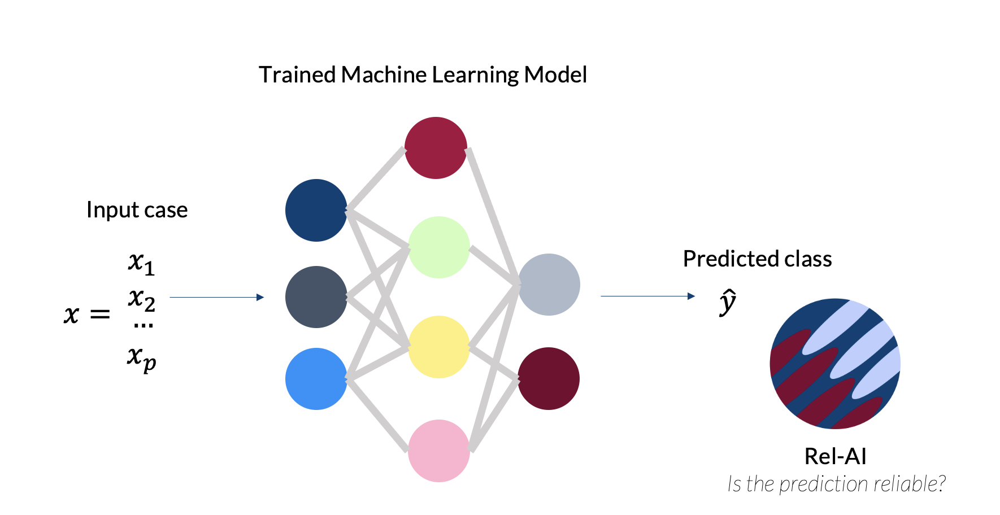

Welcome to RelAI's documentation!
===================================

**RelAI** is a Python library to compute pointwise reliability of Machine Learning predictions. 

 

**What is Machine Learning pointwise reliability?**

Pointwise reliability is the degree of trust that the prediction for a single instance is correct. Suppose you have deployed a supervised machine learning model for a specific task and you start making prediction on new cases. How do you trust these new predictions? Maybe your model was highly performing on the test set, and therefore you are more certain that also new predictions are likely to be correct. But what if the population of the new predicted cases is changing over time and/or space in comparison with the training set? What if the model was not fitted well on a subset of the features space and your new case is falling in that specific area?

These two situations are described by two principles that we can use to understand if a prediction is reliable:

* the density principle: it asks whether a sample is similar to the training set
* the local fit principle: it asks whether the model was well performing on cases similar to the new case to be classified

Rel-AI implements these two principles and helps you understand the reliability of each single case's prediction you need to evaluate with your machine learning model

Check out the :doc:`usage` section for further information, including
how to :ref:`installation` the project.

.. note::

   This project is under active development.

Contents
--------

.. toctree::

   usage
   api
